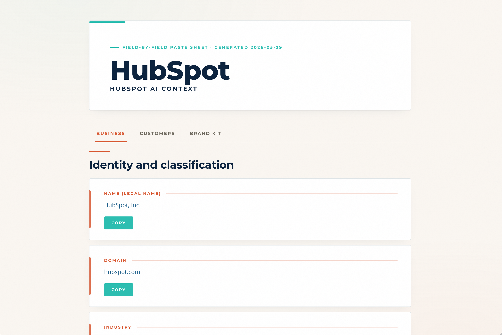

# hubspot-ai-context — Claude Skill

> HubSpot's AI Context layer (Breeze Intelligence + Brand Voice) is powerful but tedious to fill correctly. This skill researches a company end-to-end — site crawl, competitor mapping, brand reputation scan — and generates click-to-copy paste sheets that map field-for-field to HubSpot's UI. Built for the people setting up HubSpot AI for the first time, or refreshing it for clients.



## What it does

When you run this skill against a client (or your own company), it:

1. Crawls the website (homepage, About, products, blog index — plus a deep per-product crawl)
2. Reads any existing context files you maintain about the client
3. Researches competitors using industry directories + general web search
4. Scans public surfaces for reputation signals (Trustpilot, BBB, Reddit, Glassdoor where reachable)
5. Synthesizes ~30 HubSpot Company Context fields, respecting picklist constraints and character limits
6. Optionally synthesizes ICPs against HubSpot's "Create Ideal Customer Profile" form
7. Generates a click-to-copy HTML paste sheet with every value individually copyable

The paste sheets are designed for the way HubSpot's UI actually accepts data — picklist tags one at a time, semicolon-separated multi-value strings, single Copy buttons on long-form fields.

## Why a Skill instead of a slash command?

Skills are portable. They install into any Claude Code, Claude Agent SDK, or Claude harness that supports skills. Slash commands are project-scoped and don't travel.

If you're new to Claude Skills, the short version: a Skill is a folder with a `SKILL.md` file that Claude auto-loads when relevant, plus any reference files and helper scripts the skill needs. Drop the folder into `~/.claude/skills/[skill-name]/` and Claude finds it.

## Install

### Option 1 — Direct clone

```bash
git clone https://github.com/chadstamm/claude-skill-hubspot-ai-context ~/.claude/skills/hubspot-ai-context
```

### Option 2 — Clone elsewhere, then symlink

```bash
git clone https://github.com/chadstamm/claude-skill-hubspot-ai-context ~/code/claude-skill-hubspot-ai-context
ln -s ~/code/claude-skill-hubspot-ai-context ~/.claude/skills/hubspot-ai-context
```

After install, restart Claude Code (or open a new session). The skill auto-discovers — no further wiring required.

## How it works

After install, just describe what you want in any Claude Code session:

> Fill out HubSpot company context for [company.com]

The skill will:

1. **Ask you 4 quick intake questions** (strategic priorities, voice anti-patterns, target audiences, active campaigns) — paste in any context you have, or skip questions you can't answer.
2. **Crawl the company's website**, research competitors, scan brand reputation.
3. **Synthesize HubSpot Company Context fields, Brand Voice fields, and 5 ICPs.**
4. **Output one tabbed HTML paste sheet** at `output/[slug]-hubspot-paste-sheet.html` — three tabs (Brand Kit, Products & Services, ICPs), every value individually copyable.

To skip ICPs, say *"just company context."* To skip the company context and only get ICPs, say *"just the ICPs."*

## Use

In any Claude Code session, just describe what you want:

> "Fill out HubSpot company context for example.com"
> "Set up ICPs for example.com"
> "Build the paste sheet for [company name]"

The skill triggers on those phrases. It'll ask for the website URL and optionally any existing context files, then run the protocol.

You can also invoke the skill explicitly:

> "Use the hubspot-ai-context skill on example.com"

## What you get

For each run, the skill writes outputs into `output/` in your current working directory:

- `output/[slug]-hubspot-context.md` — markdown source of all field values
- `output/[slug]-hubspot-context.html` — interactive paste sheet for HubSpot Company Context
- `output/[slug]-products.md` — durable per-product reference
- `output/[slug]-competitors.md` — competitor research + reputation scan
- `output/[slug]-icps.csv` — ICP source data (if you ran ICPs)
- `output/[slug]-icps.html` — interactive paste sheet for HubSpot ICPs (if you ran ICPs)

The HTMLs auto-open in your default browser at the end of the run.

## Customize for your industry

The skill is industry-neutral by default. To improve research quality for the industries you work in:

- **Add industry directories** — edit `references/industry-directories.md` to plug in canonical directories (industry trade associations, rep directories, distributor networks, software review sites, etc.). The skill reads this file each run.
- **Maintain an ICP library** — store your prebuilt ICPs as a CSV per the schema in `templates/icp-library.example.csv`. Pass the CSV path when generating ICPs and the skill will pull from your library instead of synthesizing from scratch.
- **Brand the output HTML** — copy `templates/brand-override.example.py` into your client folder and edit colors / fonts / logo to match your brand. The build scripts pick it up automatically when present.

## Customize the field map

If HubSpot changes its Company Context or ICP UI:

- Edit `references/hubspot-company-context-fields.md` for Company Context changes
- Edit `references/hubspot-icp-fields.md` for ICP form changes

The skill protocol reads these files as ground truth.

## Repository structure

```
claude-skill-hubspot-ai-context/
├── SKILL.md                                # Main skill protocol (Claude reads this)
├── README.md                               # This file
├── LICENSE                                 # MIT
├── references/
│   ├── hubspot-company-context-fields.md  # Field map for Company Context
│   ├── hubspot-icp-fields.md              # Field map for ICPs
│   └── industry-directories.md            # User-extensible competitor research map
├── scripts/
│   └── build_company_context_html.py      # Render Company Context paste sheet
└── templates/
    ├── company-context-data.example.json  # Schema for Company Context input
    ├── icp-library.example.csv            # Schema for ICP CSV input
    └── brand-override.example.py          # Optional brand override
```

## Contributing

If you build industry-specific extensions (directory mappings, ICP libraries for a vertical, brand overrides), consider opening a PR. The skill works better the more industries it knows.

## Show your support

If this skill saved you time on a HubSpot context buildout, drop a ⭐ on the repo — it helps other HubSpot agencies and operators find it.

Built by [Chad Stamm](https://github.com/chadstamm) · [LinkedIn](https://www.linkedin.com/in/chadstamm) · [chadstamm.com](https://chadstamm.com)

## License

MIT — see LICENSE.
